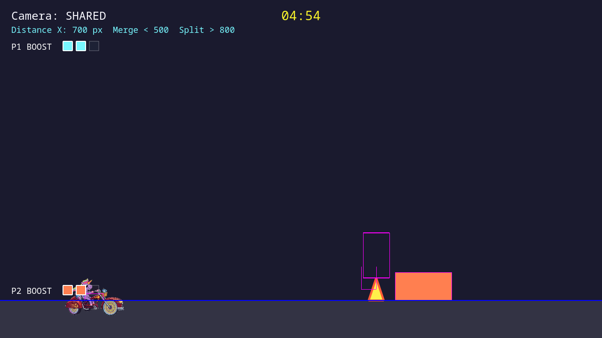
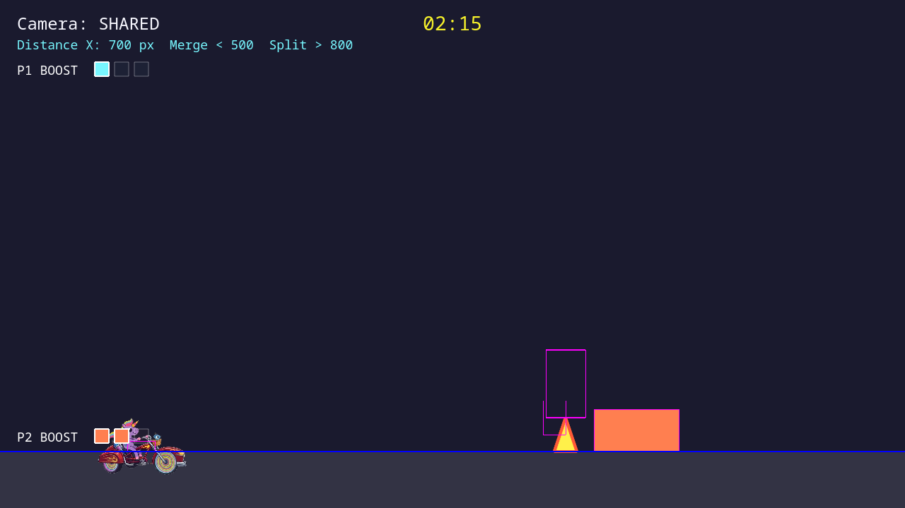

# Boost system and HUD

*2026-05-29T03:49:38Z by Showboat 0.6.1*
<!-- showboat-id: 18f88ed7-86a6-4b7f-b58e-a92ec868ba0a -->

This demo shows the boost slice:

- each player starts with 2 boost charges
- the HUD renders the boost bars for both players
- spending a boost immediately drops player 1 from 2 bars to 1

```bash {image}
screenshots/boost-system-before.png
```



```bash {image}
screenshots/boost-system-after.png
```


