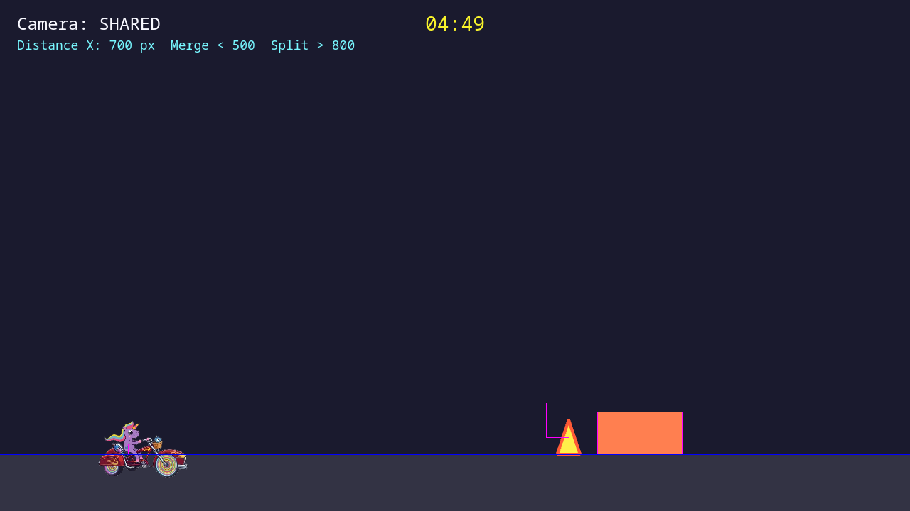

# Countdown and match timer

*2026-05-29T03:34:57Z by Showboat 0.6.1*
<!-- showboat-id: 117a8dfb-561d-49bd-9c6a-95d5e6bc0242 -->

This demo shows the match lifecycle slice:

- the game starts in `COUNTDOWN`
- the HUD shows `3`, `2`, `1`, `GO!`
- the 5-minute match timer appears at the top center
- the race state unlocks after the countdown finishes

```bash {image}
screenshots/match-countdown-timer-countdown.png
```



```bash {image}
screenshots/match-countdown-timer-race.png
```


